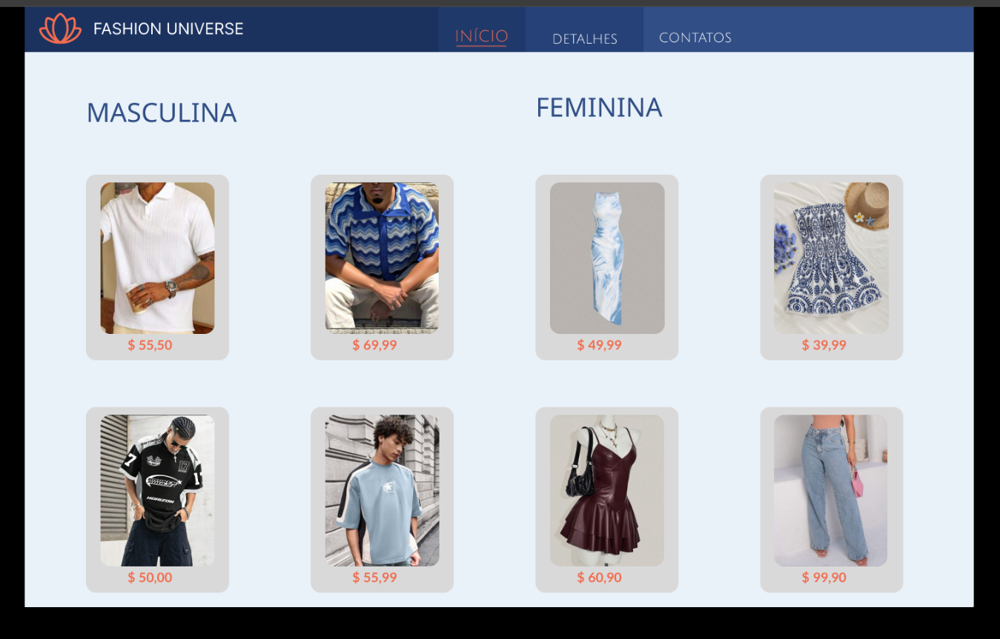
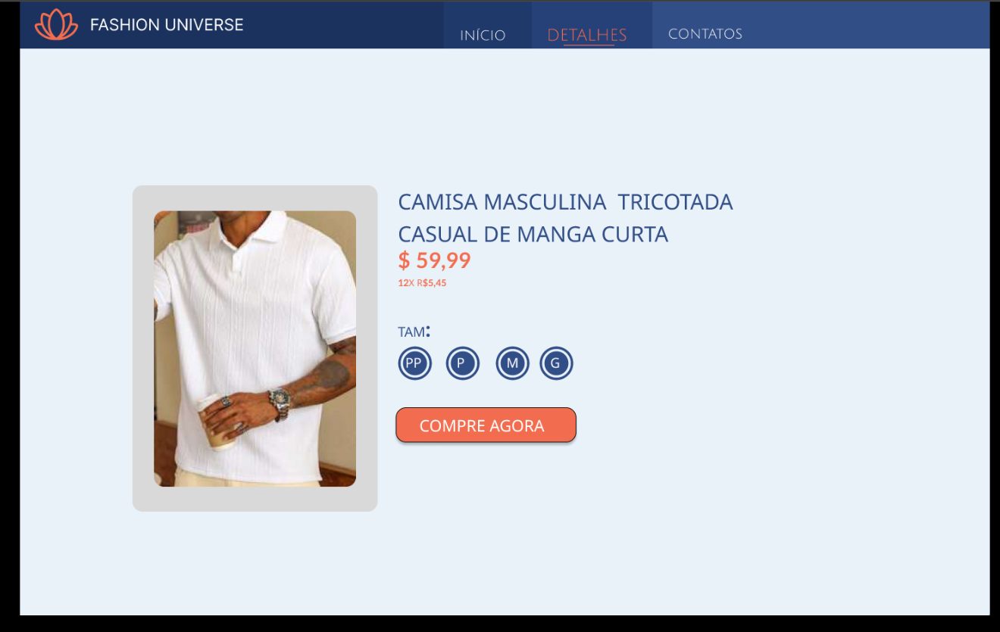
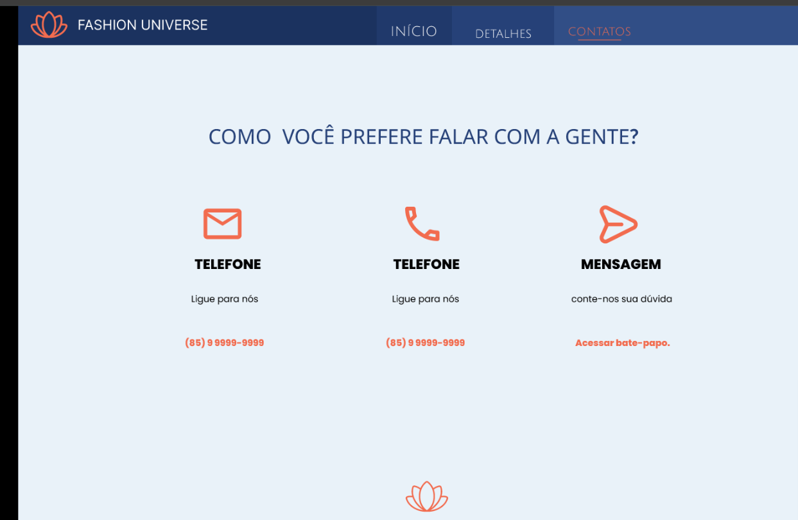
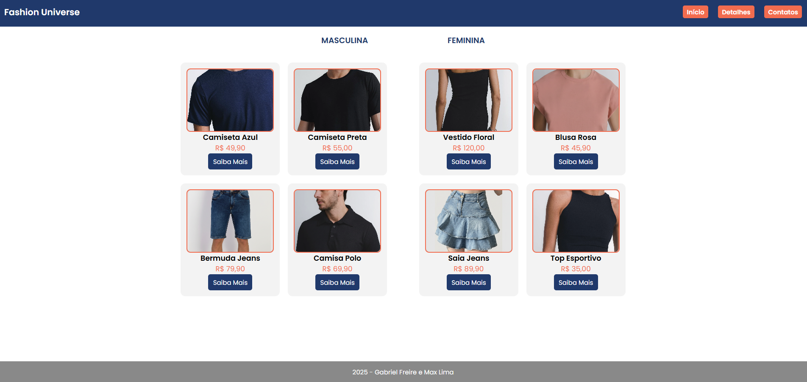
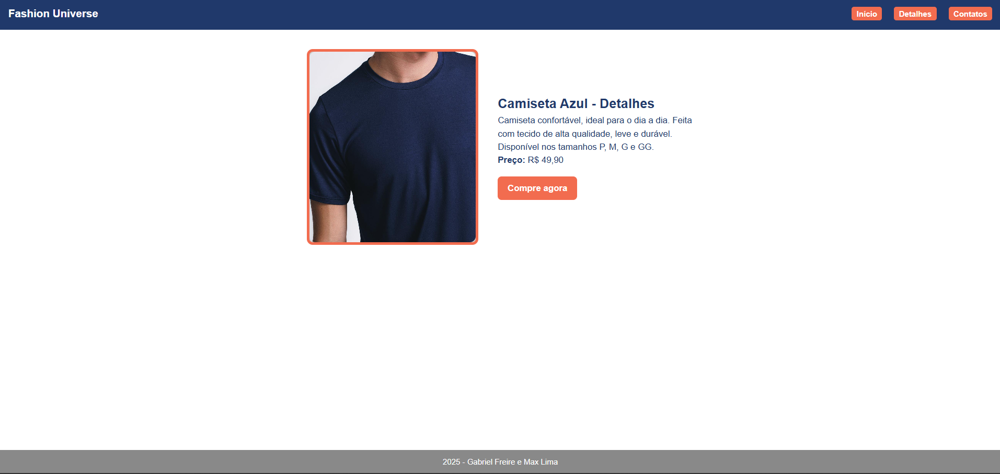
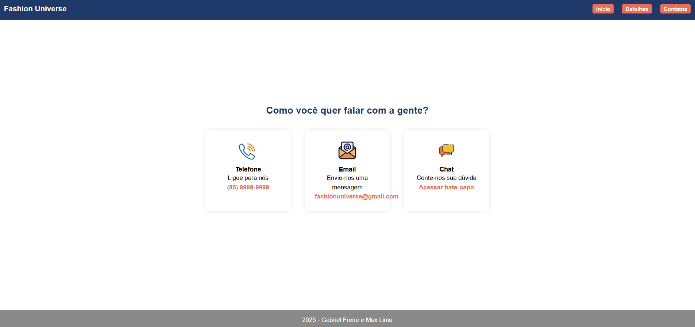

# 🛍️ Fashion Universe — Projeto de Web I

Este repositório contém o site desenvolvido para o **Projeto da disciplina Desenvolvimento Web I**, baseado no protótipo criado previamente no **Figma**.  
O site foi construído utilizando apenas **HTML** e **CSS**, seguindo todos os requisitos solicitados pelo professor.

---

## 📌 GitHub Pages (Site Publicado)
👉 [`Acesse o site`](https://gabrielfr7.github.io/Projeto-Figma/)

---

## 📸 1. Protótipo do Figma — Prints das Três Páginas

### 🏠 Página Inicial (Figma)

### 🧥 Página de Detalhes (Figma)

### 📞 Página de Contato (Figma)

---

## 🌐 2. Versão Desenvolvida em HTML/CSS — Prints das Três Páginas

### 🏠 Página Inicial (HTML/CSS)

### 🧥 Página de Detalhes (HTML/CSS)

### 📞 Página de Contato (HTML/CSS)

---

## 📝 3. Comentários — Semelhanças e Diferenças Entre o Figma e o Site 

### ✔️ Semelhanças
- Mantive a mesma paleta de cores do protótipo (azul marinho e laranja).
- A estrutura das três páginas segue o layout do Figma.
- O cabeçalho, rodapé e navegação permanecem consistentes entre todas as páginas.
- Os produtos foram organizados em cards usando Flexbox, como no protótipo.
- A página de detalhes apresenta imagem grande, descrição e preço semelhantes ao design do Figma.

### ⚠️ Diferenças

#### 🏠 Página Inicial (index.html)
- Removi o símbolo do canto superior esquerdo do cabeçalho.
- Deixei os botões do menu (Início, Detalhes, Contatos) com **uma única cor padrão**.
- Adicionei um botão **“Saiba Mais”** em cada produto.
- Coloquei uma **borda laranja** nas imagens dos produtos.
- A fonte **Poppins** foi adicionada e usada em todas as páginas.

#### 🧥 Página de Detalhes (detalhes.html)
- Todas as informações do produto foram colocadas em **um único bloco de texto**, ao invés de seções separadas.
- Mantive a **borda laranja** na imagem grande do produto.

#### 📞 Página de Contato (contato.html)
- Alterei os **símbolos/ícones** utilizados nos cards de contato para versões diferentes ou mais adequadas ao HTML/CSS.

---

## 👨🏽‍💻 Desenvolvido por
**Gabriel Freire dos Anjos e Max Lima**  
IFCE — Desenvolvimento Web I — 2025

